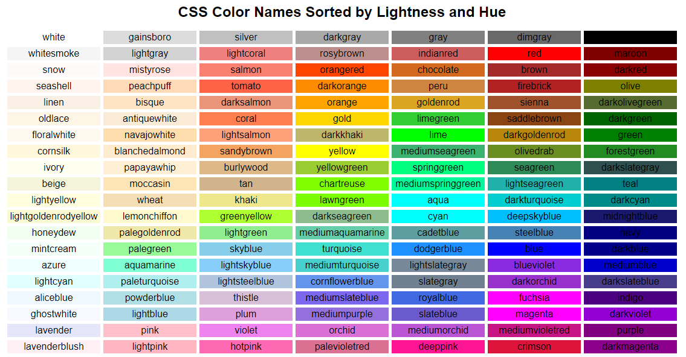

# HTML, CSS, and JavaScript

We'll be using [JSFiddle](https://jsfiddle.net/) to give an introduction to [HyperText Markup Language](https://developer.mozilla.org/en-US/docs/Web/HTML), [Cascading Style Sheets](https://developer.mozilla.org/en-US/docs/Web/CSS), and [JavaScript](https://developer.mozilla.org/en-US/docs/Web/JavaScript).

To start, go to JSFiddle: https://jsfiddle.net/. You should see four boxes on the page, with the labels HTML, CSS, and JavaScript, and "Result." This layout allows you to write code in the first three boxes and see the result in the other one all at the same time without having to have multiple windows open or anything. When we write stuff in the first three boxes, we're going to need to click "Run" or press Control-S and then the result will show up by where it says "Result." By the way, you can click minimize on the thing that says "Console." And one more thing: I would go into the "Settings" and uncheck the two settings that start with "Auto", because otherwise you'll be dealing with some autofill/autocomplete stuff that I think is more trouble than it's worth unless you're really used to it.

Okay: now we're set up, we can type code into these boxes, we just need to know what, in fact, we're typing, and where.

HTML, CSS, and JavaScript are the programming languages that web browsers understand. For this reason, they are very important. There are a lot of tools that you can use to design web pages without directly writing in these languages yourself, but those tools will all need to produce HTML, CSS, and JavaScript at some point, because a browser needs to see those before it can render a real live web page. They are the fundamental building blocks of the World Wide Web. Of these, HTML is the oldest and most fundamentalest; the [very first web page](http://info.cern.ch/hypertext/WWW/TheProject.html) was written in it in 1991. It is what you use to put stuff on your page. Web pages need stuff, so that's the first box we're going to write in.

So, HTML is a fundamentalest building block of the web, and the fundamental building blocks of HTML are called "tags." The first kind of tag is called a start tag, and it looks like this; there is a tag name (which is in this case just the letter "p") enclosed in angle brackets, which are what those greater than/less than signs are called when they are being used to enclose things.

```
<p>
```

Does anyone want to guess what the next kind of tag is called, the one that we're going to use after the start tag? It is an end tag. It is the same thing except that there's a forward slash in front of the tag name.

```html
<p></p>
```

And, wait! I almost forgot. There's one more thing you probably want to have with your start tags and end tags. That thing is called "content":

```html
<p>Hello, World!</p>
```

So there you have it. This is called an HTML element: there's a start tag, content, end tag, and the content shows up in the results square (for you too, right 🥺? You just have to hit "run"). And the weird thing is, we could stop here, that's all the HTML you really need to know.

Well. Maybe there's other stuff to learn. The weird thing about HTML is that unlike most programming languages, it's not really much of a programming language: HTML "programs" aren't necessarily interactive, it's not really grounded in logic or consistency, and everything is kind of based a lot on vibes. They don't want me to tell you this, but with a little help from the other web languages, you can stop listening here and make a whole beautiful web page out of \<p> tags if you want.

But there are, in fact, 140ish named tags other than the one named "p", so maybe we'd better figure out why. The thing, is "p" literally means "paragraph" - that's what it stands for, it's only one letter long because back when the first web page was created, the "aragraph" would've taken a long time to send - but that meaning is honestly mostly important because of the vibes that it imparts; or, what people with big fancy brains call its semantic meaning. In practice, we can bend space and time and use \<p> elements for all kinds of stuff, but the fact is, we've used a tag named "paragraph", we'd better have a pretty paragraphy use for it, or else we're writing confusing code. And in accordance with this semantic meaning, browsers display paragraphs a certain way. They have black text in a proper-looking serif font at a medium font size, and, if you have multiple paragraphs, each is displayed below the previous one with a gap between them. It's very paragraphy.

```html
<p>In the beginning the Universe was created. This has made a lot of people very angry and been widely regarded as a bad move.</p>
```

Now, like I said, we could just change how this stuff looks (and practically everyone does at least change the font) but for now, we should probably learn some of those other 140-something tags, so we can let paragraphs be paragraphy and just take advantage of the semantic meaning and the pre-defined styles of the other ones. Like header tags:

```html
<h1>Green Eggs and Ham</h1>
<h2>Dr. Seuss</h2>
<p>I could not, would not, would not, boat.</p>
<p>I will not, still not, shall not stoat.</p>
```

I think that's how that book goes; I could never really follow it. (I was a very stupid child.) So yeah, these are some other tag names, which happen to have numbers in them. And H1 and H2 stand for heading 1 and heading 2, with heading 1 having the semantic meaning of being more important and therefore, look, it shows up as bigger text by default. Those are tags we should use for things like titles and author names. In theory there are also headings 3 through 12, which you can use if you like to signify less and less important headings. Um, you don't have to type all this exactly, but is everyone who wants to try out writing this HTML caught up?

Because next, I'm going to introduce something iconic and kind of weird: the anchor tag.

```html
<a>Click me!</a>
```

Well. You probably all know that that's not what it usually looks like. To manifest its true form, we need to add our first attribute. Attributes are placed after the tag name in the start tag and add some information to the HTML element.

```html
<a href="https://crouton.net/">Click me!</a>
```

So yeah. An anchor tag with an href attribute will create a link to another web page so you can go there if you click it. Except, wait, ours is kind of weird right now, because the new page will open inside the little JSFiddle box. Try this:

```html
<a href="https://crouton.net/" target="_blank">Click me!</a>
```

And now we have two examples of attributes. Attributes live in start tags, go after the tag name, and say `this="that"`. The first thing is called the attribute name and the second thing, in quotes, is called the attribute value. The "href" attribute gives the information "what page should this link link to" and the "target" attribute gives the information "this page should be opened in a new tab." We need that second thing when using JSFiddle because we don't want the page we're linking to to be trapped in the box, but it's also useful whenever you want a link to open a new tab so the viewer doesn't lose their place on the last page or whatever.

And you might, at this point, feel a little like you're looking at a bunch of gibberish, and that is basically correct. The thing about these web languages is that there's a bunch of stuff in them that made sense to someone at some point and now we're stuck with it because changing it would mean breaking compatability with a whole universe of old websites. This attribute name, "href," stands for "hypertext reference" because at some point someone thought that term would become a thing, and then, that term did not become a thing. However, we're stuck with it; it's used in the very first web page; and thus we just have to learn it. Same with the "_blank" value for "target"; the underscore is there because of history and if you leave it out weird stuff might start happening. It all looks a little strange but we must simply learn it and declare victory and move on.

Now that we have the basics down, we can probably go through some more types of tags pretty quickly. Watch this, you can put HTML elements inside HTML elements:

```html
<p>Now, <strong>this</strong> is a story all about <em>how</em></p>
```

Back in the day, they used to use tags just called "b" and "i" for a similar effect but those tags are old and everyone who used them has died by now, and if you invoke them, you will have an encounter with ghosts.

"details" tags are interactive:

```html
<details>🤠</details>
```

You can add "summary" tags inside them to change the initially visible text:

```html
<details>
  <summary>Click here to say howdy</summary>
  🤠
</details>
```

Putting tags on different lines like that is allowed. HTML wants you to be able to format your code with spaces and newlines without changing how the content is displayed, so we can actually put new lines practically wherever we want. If we want an actual line break that will show up for real in the content, one thing that we can do use the \<br /> tag:

```html
<p>
  You say goodbye <br />
  and I say hello
</p>
```

See, if I remove that, there's no line break in the result, even though there is in the code. We need the \<br />. You may notice something weird about that particular tag: since there's no real content that it can encompass, there's no need for it to have a start and an end tag. Instead, it's what's referred to as self-closing: it ends at the same place it begins. (Most people will use that end-tag-style slash to indicate this, but you technically don't even need that.)

And here's another very popular self-closing tag:

```html

```

Images! You know them, you love them.

So, that was a lot of tags. Let's look over the chaos we have created.

All of those tags have some kind of specific purpose, indicated by their name. But there's one more tag we're going to look at that's extremely popular because it has no real specific purpose. This tag is called \<div>, which stands for content division, and it's basically the clear plastic tupperware of tags: you just put stuff in it. The idea is that you use it to divide content into sections, usually so that you can impose some kind of layout. For example, we can use them to group some elements into columns:

```html
<div>
  <h2>To-Do List - Yesterday</h2>
  <p>Walk dog</p>
  <p>Solve world hunger</p>
  <p>Do laundry</p>
  <p>Be less sad</p>
</div>
<div>
  <h2>To-Do List - Today</h2>
  <p>Walk dog</p>
  <p>Solve world hunger</p>
  <p>Actually do laundry</p>
  <p>Be less sad</p>
</div>
```

So that's great. But these "columns" are just above and below each other, so the divs don't make much difference. To see what I mean, we're going to have to shake up the top-to-bottom normal page layout and place these columns side-by-side. The first step to doing that is to isolate them from the rest of the content by making a div that will contain these two existing divs. Initially, we used divs to put elements that should be in the same column in a group together; now, we're going to place our columns in a div that exists to contain the elements that we want to be in a row together. I'm going to give this overarching div an id attribute with the value "row-container".

```html
<div id="row-container">
<div>
  <h2>To-Do List - Yesterday</h2>
  ...
</div>
<div>
  <h2>To-Do List - Today</h2>
  ...
</div>
</div>
```

Now, brace yourselves, because we're going to need to attempt to use CSS to alter the page layout for the next step. Click over to the CSS box in JSFiddle (finally, right?) and type this:

```css
#row-container {
  display: flex;
}
```

Let's break this code down. The first thing we typed is a CSS selector, which specifies what elements we're altering. There are a lot of different ways to select elements in CSS, but if you use the pound sign/hashtag symbol, you can select elements according to their ID attribute, like this. We will then write declarations that apply to the selected things. Those are expressed within the curly braces that immediately follow. There, we have one single declaration: `display: flex;`. A declaration consists of a property, in this case "display", and a value, in this case "flex".

There are many, many properties in CSS, each with their own set of possible values, but this property, the display property, is very important; basically, it sets the layout mode that will be applied to elements that we're selecting. This is kind of like the anchoring mode that you can set for images in Microsoft Word, to control whether text goes around them or above and below them. When you set the layout mode of a div to "flex", its becomes a row or column (by default a row) in which you can control the alignment and spacing of elements in a fine-grained way.

Our div columns are still kind of ugly because they're smashed together. Let's fix that with a few more CSS properties.

```css
#row-container {
  display: flex;
  width: 100%;
  justify-content: space-evenly;
  text-align: center;
  font-family: sans-serif;
}
```

These properties are relatively straightforward. The second one stretches our row to take the whole width of the page. The third spaces out the elements in the row evenly; without that, they'll default to sitting at the beginning of the row, no matter how wide it is. Finally, I want to center the text inside the columns and change the font because I think that looks better.

Now we're experienced with CSS rules. This is most of what you do with CSS; you put a selector to indicate which elements you're doing stuff to, and then you say what stuff you want to do to them, like changing the text alignment. I should probably give everyone a second to catch up with these layout rules that we're using.

And now that we're experienced with rules, let's try using some different selectors. Remember, those are the things in front of the curly braces that determine which elements we're controlling. In our columns, which are created by these divs, we have h2 elements for our list headers and p elements for our items. Let's try selecting just the p elements that are inside the columns. We can do this by just putting `#row-container p` as our selector: when you separate two selectors with a space, you first take all the elements that are inside the one indicated by the first selector, and then narrow it down to the elements that match the second selector. (Tag names work as selectors all by themselves.)

```css
#row-container p {
  color: purple;
  cursor: pointer;
}
```

Notice that the other paragraphs that we have up above haven't changed; only the ones inside divs did. (We could select all the paragraphs everywhere by just using "p" as a selector, but I want to let them rest.) One more really fun selector is the "hover" one, which only applies to elements when your mouse is over them.

```css
#row-container:hover {
  background-color: paleturquoise;
}
```

There are [a lot of different named colors](http://davidbau.com/colors/) in CSS, so try random stuff there, knock yourself out.



So yeah. CSS is used both to lay the page out and to change the visual style and appearance of things in it. Using the display property changes elements' layout modes, so for example, you can use `display: flex;` to create rows (or columns) and change how elements are aligned and spaced out inside them; and there are a bunch of words involved that you sadly just have to memorize. And that's probably enough CSS for one lifetime.

JavaScript is completely different from either of the two previous languages. It is an honest-to-god real programming language in which you write statements that are executed in sequence according to logical expressions that you specify. There is no real limit to the kinds of programs you can write in JavaScript, but here, we're going to use it only for its original intended purpose - manipulating things on webpages. As a programming language, JavaScript uses variables - so we're going to start by storing an HTML element in a variable.

```js
const rowContainer = document.querySelector("#row-container");
```

This is called an assignment statement, and basically what it does is store the thing on the right side of the equals sign under the name that's on the left side of the equals sign. The thing on the left side of the equals sign is called a variable. You might say that there are, in fact, two things on the left side of the equals sign, but the first thing, "const", is more like an annotation than a name: it just indicates that we're creating a brand new variable, which I am calling "rowContainer", and that that variable is going to be constant - I don't want to be able to change what's stored in it later. The thing on the right side of the equals sign is a function call that grabs the HTML element on the page that matches the selector "#row-container". You've seen this selector before. We used it to select a div and turn it into a row of things. It turns out you can use these guys in JavaScript too. So, in summary, we are storing the HTML element with the ID attribute "row-container" in the variable `rowContainer`.

The next thing we want to do is define an action that will edit or alter the items that we have in our list. We are going to do that by creating what is called an event listener. An event listener is a type of function, which is a piece of code that can be run over and over again. You can define functions a few ways in JavaScript, but the most basic way is to write the following: the word "function"; the name of the function; a parenthesized list of input variables for the function; and then the function's executable code inside curly braces.

```js
function crossOut(click) {
  if (click.target.tagName == "P")
	  click.target.style.textDecoration = "line-through";
}
```

An event listener is triggered by an event, and an event is a thing that a user does, such as: a click. So the input to our function is a representation of a click that just happened, and thus I am using the word "click" as the name I want it to have. This particular representation is an object, which works sort of like a variable with more variables inside it. We can reach the variables that are inside it by using the dot operator. We can access the event target, which is the HTML element that got clicked. We can access the target's tag name, which will be in all caps for historical reasons, and we can check to see if it's a "p" element that we might want to cross out. And then we can access the style of the target, which is the set of CSS rules that determine how it's displayed, and then the CSS property called "textDecoration", and then we can give it the value "line-through". Unfortunately, all of these variable names except "click" are a built-in part of the browser's internal representation of events and HTML elements, and they just have to be learned. They are part of a system that kinda-sorta makes sense, but for now, here are some names of things; string them together.

Finally, we are going to attach our event listener to the element we selected earlier by setting the onClick variable that exists inside it.

```js
rowContainer.onclick = crossOut;
```

Once we have done that, every actual real life click inside our row of lists will trigger our event listener function to run. This function will edit one of the CSS style rules that apply to our HTML element. So, look: when you click on one of our list items, it gets crossed out.

Now, you may notice that nothing in our HTML or CSS text boxes changes when this event listener executes. Our HTML and CSS serve to initially set up our webpage; once JavaScript starts executing, all bets are off, and the content of the page can diverge wildly from how it was originally specified. You can use the well-known "Inspect Element" tool that browsers provide to get a look at how the HTML and CSS would look if they kept up to date with the changes that JavaScript makes, although it might take a while to get used to all the stuff that that tool shows you.

[Final JSFiddle](https://jsfiddle.net/ytms1g6u/)

If we have time, there's one more thing that you can try if you want. I want you to open up a new blank plain text file in an editor like Notepad, TextEdit, or nano. Copy down or copy and paste the following HTML tags, I'll put them in the Discord:

```html
<html>
<head>
<style>
  /* Put CSS right below this */

</style>
</head>

<body>
<!-- Put HTML right below this -->

<script>
// Put JavaScript right below this

</script>

</body>

</html>
```

These are the actual most basic HTML tags that form the backbone for every page. This gives you an organized way to combine HTML, CSS, and JavaScript into a single final file; it's just standard boilerplate-type stuff and you can just find a template like this online and copy-paste that into every new webpage that you ever create. JSFiddle was secretly putting our content into a template like this behind the scenes.

Within these tags, you should insert the content we have created where the comments say to (yes, each language has its own different style of comments that let you leave human-readable notes that don't do anything.) Then, you can save the file as a .html file. Then you can open it in your web browser. And then you can send the file to anyone, upload the file to website hosting services like Neocities or Github Pages, or place the file in a special folder that Kent gives you to make it available on the public Internet. (That requires a seperate program to log into a certain account that Kent gives you - we can go over that after the lesson if you want.) Anyway: HTML. CSS. JavaScript. Content, presentation, interactivity. Combine them and utilize all of their different powers. That is how you create a webpage.
