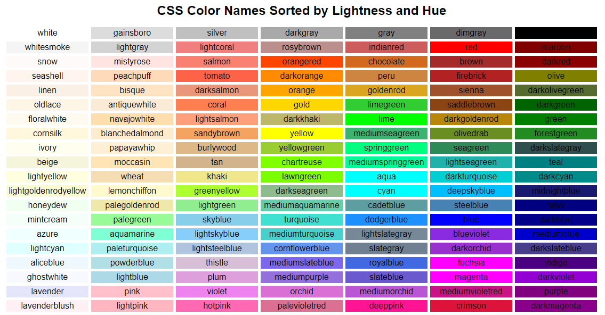

# HTML, CSS, and JavaScript

We'll be creating local HTML files to give an introduction to [HyperText Markup Language](https://developer.mozilla.org/en-US/docs/Web/HTML), [Cascading Style Sheets](https://developer.mozilla.org/en-US/docs/Web/CSS), and [JavaScript](https://developer.mozilla.org/en-US/docs/Web/JavaScript).

To begin with, you should know that a webpage looks like this:

```html
<!DOCTYPE html>
<html>
<head>
<style>

[CSS goes here]

</style>
</head>
<body>

[HTML goes here]

<script>

[JavaScript goes here]

</script>
</body>
</html>
```

This is the basic template for an HTML page. You can copy this template, paste it into a text editor (like Notepad on Windows, TextEdit on macOS in plain text mode, or VS Code), save it with a `.html` extension (like `my-webpage.html`), and then open it in your web browser to see your webpage!

But this template is not that interesting and it's kind of incorrect, because it just says things like "CSS goes here" where actual CSS should go. Our job today is to come up with some code that will replace those "goes here" labels with real HTML, CSS, and JavaScript.

## Getting Started

1. **Create a new HTML file**: Open your text editor and create a new file
2. **Copy the basic template**: Use the template above as your starting point
3. **Save the file**: Save it with a `.html` extension (like `practice.html`)
4. **Open in browser**: Double-click the file to open it in your default web browser, or right-click and choose "Open with" to select a specific browser
5. **Edit and refresh**: Make changes to your HTML file, save it, then refresh the browser to see your changes

Let's start by looking at the example file `result.html` in this repository to see what a complete webpage looks like, then we'll learn how to build it step by step.

Now we're set up to write code directly in HTML files and see the results in our browser. We just need to know what, in fact, we're typing, and where.

HTML, CSS, and JavaScript are the programming languages that web browsers understand. For this reason, they are very important. There are a lot of tools that you can use to design web pages without directly writing in these languages yourself, but those tools will all need to produce HTML, CSS, and JavaScript at some point, because a browser needs to see those before it can render a real live web page. They are the fundamental building blocks of the World Wide Web. Of these, HTML is the oldest and most fundamentalest; it is what you use to put stuff on your page. Web pages need stuff, so let's start by putting some content in the `<body>` section of our HTML template.

## HTML: Adding Content to Your Page

So, HTML is a fundamentalest building block of the web, and the fundamental building blocks of HTML are called "tags." The first kind of tag is called a start tag, and it looks like this; there is a tag name (which is in this case just the letter "p") enclosed in angle brackets, which are what those greater than/less than signs are called when they are being used to enclose things.

```
<p>
```

Does anyone want to guess what the next kind of tag is called, the one that we're going to use after the start tag? It is an end tag. It is the same thing except that there's a forward slash in front of the tag name.

```html
<p></p>
```

And, wait! I almost forgot. There's one more thing you probably want to have with your start tags and end tags. That thing is called "content":

```html
<p>Hello, World!</p>
```

So there you have it. This is called an HTML element: there's a start tag, content, end tag, and the content shows up in your browser when you save the file and refresh the page.

**Try it yourself**: Replace the `[HTML goes here]` in your template with:
```html
<p>Hello, World!</p>
```

Save your file and refresh your browser to see the result!

To show how other tag names work, let's try another example. Instead of "p", we'll try "h1":

```html
<h1>Pet Turtles Like Music</h1>
```

h1 stands for heading 1. It is the most powerful of all of the headings. There's a whole set of them, ranging form h1 all the way to h12. Let's try h2:

```html
<h1>Pet Turtles Like Music</h1>
<h2>They Flip Their Legs In Waltz Tempo</h2>
```

And let's go the rest of the way to reproducing [this newspaper headline from 1932](https://yesterdaysprint.tumblr.com/post/175748913854/des-moines-tribune-iowa-january-19-1932) by adding an image. Image tags are a little different: they can be what is called self-closing. In other words, you only have to write one thing that serves as both a start and an end tag; this holds for basically all tags that don't have text content, which is a few of them. The basic format is like this:

```html

```

But we need to add some extra information to this HTML element to tell it what image to load and display. For this, we need an HTML attribute. An attribute looks a little like a string variable in other programming languages; it has a name:

```html

```

And a value:

```html

```

So attributes follow this format, name="value", and the name that you use for an attribute determines the effect it will have and what the value will be used for. In this case, the name "src" stands for source and means an image will be loaded from the URL given in the attribute's value. There's another useful attribute that we can use here, "width":

```html

```

This will set the image's width to 300 pixels wide. Try adding this to your HTML file between some paragraphs and see what happens!

Because next, I'm going to introduce something iconic and kind of weird: the anchor tag.

```html
<a>Click me!</a>
```

Well. You probably all know that that's not what it usually looks like. To manifest its true form, we need to add another attribute. When there's a start tag and an end tag, the attribute will always go in the start tag:

```html
<a href="https://crouton.net/">Click me!</a>
```

So yeah. An anchor tag with an href attribute will create a link to another web page so you can go there if you click it. The "href" attribute gives the information "what page should this link link to" and the "target" attribute gives the information "this page should be opened in a new tab." The `target="_blank"` attribute is useful whenever you want a link to open a new tab so the viewer doesn't lose their place on your page.

**Try it**: Add this link to your HTML file and test it in your browser:
```html
<a href="https://drawing.garden" target="_blank">Click me!</a>
```

And you might, at this point, feel a little like you're looking at a bunch of gibberish, and that is basically correct. The thing about these web languages is that there's a bunch of stuff in them that made sense to someone at some point and now we're stuck with it because changing it would mean breaking compatability with a whole universe of old websites. This attribute name, "href," stands for "hypertext reference" because at some point someone thought that term would become a thing, and then, that term did not become a thing. However, we're stuck with it; it's used in the very first web page; and thus we just have to learn it. Same with the "_blank" value for "target"; the underscore is there because of history and if you leave it out weird stuff might start happening. It all looks a little strange but we must simply learn it and declare victory and move on.

We've now learned approximately enough HTML to create the very first website. It looks like [this](http://info.cern.ch/hypertext/WWW/TheProject.html), it's from 1991, and it just had text. No turtle pics. But everybody's got to start somewhere.

Now that we have the basics down, we can probably go through some more types of tags pretty quickly. Here's something that won't work: let's take [some ASCII art](https://www.asciiart.eu/nature) and put it in a `<p>` tag:

```html
<p>
        __I__
   .-'"  .  "'-.
 .'  / . ' . \  '.
/_.-..-..-..-..-._\ .---------------------------------.
         #  _,,_   ( I hear it might rain people today )
         #/`    `\ /'---------------------------------'
         / / 6 6\ \
         \/\  Y /\/       /\-/\
         #/ `'U` \       /a a  \               _
       , (  \   | \     =\ Y  =/-~~~~~~-,_____/ )
       |\|\_/#  \_/       '^--'          ______/
       \/'.  \  /'\         \           /
        \    /=\  /         ||  |---'\  \
   jgs  /____)/____)       (_(__|   ((__|
</p>
```

The thing with HTML is that you're supposed to be allowed to put spaces wherever you want so that you can format your code properly. If you have many spaces, they get collapsed down to one space, and if you have multiple lines, they get treated as one, because normally when you write text like they did back in the day, normally you want text to flow and be wrapped at the edge of your browser and spaces are just used as indents in code. To change this, we can just use the HTML `<pre>` tag instead of `<p>`. Believe it or not, "pre" stands for "preserve whitespace."

```html
<pre>
        __I__
   .-'"  .  "'-.
 .'  / . ' . \  '.
/_.-..-..-..-..-._\ .---------------------------------.
         #  _,,_   ( I hear it might rain people today )
         #/`    `\ /'---------------------------------'
         / / 6 6\ \
         \/\  Y /\/       /\-/\
         #/ `'U` \       /a a  \               _
       , (  \   | \     =\ Y  =/-~~~~~~-,_____/ )
       |\|\_/#  \_/       '^--'          ______/
       \/'.  \  /'\         \           /
        \    /=\  /         ||  |---'\  \
   jgs  /____)/____)       (_(__|   ((__|
</pre>
```

Now we have some respectable art. Outside of `<pre>` tags, you can still have newlines, you just have to use the `<br />` tag:

If we want an actual line break that will show up for real in the content, one thing that we can do use the \<br /> tag:

```html
<p>
  You say goodbye <br />
  and I say hello
</p>
```

`<br />` stands for line break and, kind of like ``, it is a self-closing tag, meaning that you only need one instead of having a start and an end tag.

Watch this, you can put HTML elements inside HTML elements:

```html
<p>meow <em>meow</em> <strong>meow</strong>/p>
```

Back in the day, they used to use tags just called "b" and "i" for a similar effect but those tags are old and everyone who used them has died by now, and if you invoke them, you will have an encounter with ghosts.

"details" tags are interactive:

```html
<details>🤠</details>
```

You can add "summary" tags inside them to change the initially visible text:

```html
<details>
  <summary>Click here if you want to say howdy</summary>
  🤠
</details>
```

So, that was a lot of tags. Let's look over the chaos we have created.

The `<details>` tag is interesting because it's the first interactive one we've used. Even something as simple as this can be used to interesting effect if you get into it. Check out this poem, ["soft corruptor"](https://media.cordite.org.au/soft-corrupter/); if you view the source of the page, you'll see that it's entirely made out of details and summary tags.

Okay, so all of the tags we've looked at so far have some kind of specific purpose, indicated by their name. But there's one more tag we're going to look at that's extremely popular because it has no real specific purpose. This tag is called \<div>, which stands for content division, and it's basically the clear plastic tupperware of tags: you just put stuff in it. The idea is that you use it to divide content into sections, usually so that you can impose some kind of layout. For example, we can use them to group some elements into columns:

```html
<div>
  <h2>To-Do List - Yesterday</h2>
  <p>Walk dog</p>
  <p>Solve world hunger</p>
  <p>Do laundry</p>
  <p>Be less sad</p>
</div>
<div>
  <h2>To-Do List - Today</h2>
  <p>Walk dog</p>
  <p>Solve world hunger</p>
  <p>Actually do laundry</p>
  <p>Be less sad</p>
</div>
```

So that's great. But these "columns" are just above and below each other, so the divs don't make much difference. To see what I mean, we're going to have to shake up the top-to-bottom normal page layout and place these columns side-by-side. The first step to doing that is to isolate them from the rest of the content by making a div that will contain these two existing divs. Initially, we used divs to put elements that should be in the same column in a group together; now, we're going to place our columns in a div that exists to contain the elements that we want to be in a row together. I'm going to give this overarching div an id attribute with the value "row-container".

```html
<div id="row-container">
<div>
  <h2>To-Do List - Yesterday</h2>
  ...
</div>
<div>
  <h2>To-Do List - Today</h2>
  ...
</div>
</div>
```

Now, brace yourselves, because we're going to need to attempt to use CSS to alter the page layout for the next step. In your HTML template, replace the `[CSS goes here]` section with this:

```css
#row-container {
  display: flex;
}
```

Let's break this code down. The first thing we typed is a CSS selector, which specifies what elements we're altering. There are a lot of different ways to select elements in CSS, but if you use the pound sign/hashtag symbol, you can select elements according to their ID attribute, like this. We will then write declarations that apply to the selected things. Those are expressed within the curly braces that immediately follow. There, we have one single declaration: `display: flex;`. A declaration consists of a property, in this case "display", and a value, in this case "flex".

There are many, many properties in CSS, each with their own set of possible values, but this property, the display property, is very important; basically, it sets the layout mode that will be applied to elements that we're selecting. This is kind of like the anchoring mode that you can set for images in Microsoft Word, to control whether text goes around them or above and below them. When you set the layout mode of a div to "flex", its becomes a row or column (by default a row) in which you can control the alignment and spacing of elements in a fine-grained way.

Our div columns are still kind of ugly because they're smashed together. Let's fix that with a few more CSS properties. Update your CSS to include these additional styles:

```css
#row-container {
  display: flex;
  width: 100%;
  justify-content: space-evenly;
  text-align: center;
  font-family: sans-serif;
}
```

Save your HTML file and refresh your browser to see the changes!

These properties are relatively straightforward. The second one stretches our row to take the whole width of the page. The third spaces out the elements in the row evenly; without that, they'll default to sitting at the beginning of the row, no matter how wide it is. Finally, we center the text inside the columns and change the font because it looks better.

## CSS Selectors and Styling

Now we're experienced with CSS rules. This is most of what you do with CSS; you put a selector to indicate which elements you're doing stuff to, and then you say what stuff you want to do to them, like changing the text alignment.

And now that we're experienced with rules, let's try using some different selectors. Remember, those are the things in front of the curly braces that determine which elements we're controlling. In our columns, which are created by these divs, we have h2 elements for our list headers and p elements for our items. Let's try selecting just the p elements that are inside the columns. We can do this by just putting `#row-container p` as our selector: when you separate two selectors with a space, you first take all the elements that are inside the one indicated by the first selector, and then narrow it down to the elements that match the second selector. (Tag names work as selectors all by themselves.)

Add this CSS rule to your stylesheet:

```css
#row-container p {
  color: purple;
  cursor: pointer;
}
```

Notice that if you have other paragraphs outside the row container, they haven't changed; only the ones inside the row container did. (We could select all the paragraphs everywhere by just using "p" as a selector.) 

One more really fun selector is the "hover" one, which only applies to elements when your mouse is over them. Add this rule and try hovering over your row container:

```css
#row-container:hover {
  background-color: paleturquoise;
}
```

There are [a lot of different named colors](http://davidbau.com/colors/) in CSS, so try random stuff there, knock yourself out.



So yeah. CSS is used both to lay the page out and to change the visual style and appearance of things in it. Using the display property changes elements' layout modes, so for example, you can use `display: flex;` to create rows (or columns) and change how elements are aligned and spaced out inside them; and there are a bunch of words involved that you sadly just have to memorize. And that's probably enough CSS for one lifetime.

## JavaScript: Making Pages Interactive

JavaScript is completely different from either of the two previous languages. It is an honest-to-god real programming language in which you write sequences of commands that are executed in order and make decisions based on logic and stuff. One thing I should probably clarify: there is a programming language that is just called "Java"; it was very popular in the 90s and 2000s and was even used to make little interactive programs on web pages called Java applets; when JavaScript was created, it was named after Java with the promise that it could integrate with Java programs, then that never really happened, and today Java and JavaScript are two languages with absolutely no relationship between them. Oh well.

JavaScript has functions. The most basic one that we can test out is called `alert`. Replace the `[JavaScript goes here]` section in your HTML template with:

```js
alert("hello");
```

Save and refresh your browser - you should see a popup!

It also has variables. In JavaScript, the modern recommended practice is to create variables with the keyword "const". You never have to specify the type of a variable when you create it, like, you don't have to say whether it's a string or an int or a double or whatever, but you do have to specify whether you want to change it later. For some reason. Unless you do need to change a variable later, you should use the word "const" to create it.

```js
const myName = "Mitch";
alert("hello " + myName);
```

That's pretty predictable, so instead of setting the name directly, let's use another function called "prompt". Update your JavaScript to:

```js
const myName = prompt("what is ur name?");
alert("hello " + myName);
```

And finally, let's explore the true power of JavaScript, the reason that everyone uses it: it can modify the contents of a page. This is a little bit tricky because JavaScript can modify HTML, but it only does so after the HTML is loaded normally from code; by the time the JavaScript runs, the HTML has already been used to create the page, and changes to the page won't affect the original HTML code. So, in other words, we aren't going to modify the HTML code with JavaScript; just the page that it created; so don't look at your HTML code to see the changes - look at the browser! Try this:

```js
const myName = prompt("what is ur name?");
alert("hello " + myName);
document.write(myName+" is here :D");
```

Save your file and refresh the browser to see JavaScript modify your page in real-time!

So yeah. That's a basic introduction to HTML, CSS, and JavaScript. No one has ever quite mastered any of them, so we're safe to leave off for now.

## Complete Example

Check out the `result.html` file in this repository to see a complete working example that demonstrates all these concepts together! You can open it in your browser to see a fully functional webpage with:

- HTML content and structure
- CSS styling and layout
- Interactive JavaScript functionality

## Tips for Local Development

- **Save frequently**: Always save your HTML file before refreshing the browser
- **Use a good text editor**: VS Code, Sublime Text, or even Notepad++ work well
- **Open Developer Tools**: Press F12 in most browsers to see errors and inspect your code
- **Test in multiple browsers**: Different browsers may display things slightly differently

## Next Steps

Try modifying the `result.html` file to:
- Change the colors and fonts
- Add more content
- Experiment with different layouts
- Add more interactive JavaScript features

---

# Part 2: Making Your Website Live on the Internet

Now that you've created a website locally, you probably want to share it with the world! Here are two excellent options for hosting your HTML, CSS, and JavaScript files for free.

## Option 1: Vercel (Recommended for Beginners)

[Vercel](https://vercel.com/) is a modern hosting platform that's perfect for static websites. It's completely free for personal projects and incredibly easy to use.

### Getting Started with Vercel

1. **Create a Vercel account**: Go to [vercel.com](https://vercel.com/) and sign up with your GitHub account (recommended) or email

2. **Prepare your files**: Make sure all your HTML, CSS, and JavaScript files are in a single folder on your computer

3. **Deploy your site**:
   - Click "New Project" in your Vercel dashboard
   - Choose "Import Git Repository" if your code is on GitHub, or
   - Drag and drop your folder directly onto the Vercel website
   - Vercel will automatically deploy your site and give you a live URL!

4. **Your site is live**: Vercel will provide you with a URL like `your-project-name.vercel.app` that you can share with anyone

### Benefits of Vercel:
- ✅ **Free forever** for personal projects
- ✅ **Automatic HTTPS** (secure connections)
- ✅ **Global CDN** (fast loading worldwide)
- ✅ **Custom domains** (you can use your own domain name)
- ✅ **Automatic deployments** (if connected to GitHub, updates when you push code)

## Option 2: University public_html Folder

If you're a student at Kent State or another university, you likely have access to a `public_html` folder on the university servers.

### Using public_html at Kent State

1. **Access your home directory**: 
   - Connect to the university servers wasp, hornet, or scorpion the same way you would for cs2 or cs3
   - Look for a folder called `public_html` in your home directory

2. **Upload your files**:
   - Copy your HTML, CSS, and JavaScript files into the `public_html` folder
   - Make sure your main page is named `index.html`

3. **Access your site**:
   - Your website will be available at a URL like: `https://www.cs.kent.edu/~yourusername/`
   - Replace `yourusername` with your actual university username

### Benefits of public_html:
- ✅ **Free** (included with your student account)
- ✅ **Educational** (good for learning about traditional web hosting)
- ✅ **University resources** (often has good bandwidth and uptime)

## Which Option Should You Choose?

**Choose Vercel if:**
- You want the easiest setup process
- You plan to continue web development after graduation
- You want modern features like automatic deployments
- You want to learn industry-standard tools
- You want to learn more common web frameworks, like react, svelte, and vue

**Choose public_html if:**
- You want to learn traditional web hosting
- You're comfortable with file transfer protocols (FTP/SFTP)
- You want to keep everything within university systems
- You're interested in understanding how web servers work

## Making Your Site Even Better

Once your site is live, consider these improvements:

### Performance
- **Optimize images**: Use tools like [TinyPNG](https://tinypng.com/) to compress images
- **Minify CSS/JS**: Remove unnecessary spaces and comments for faster loading

### Accessibility
- Add `alt` attributes to all images
- Use proper heading hierarchy (h1, h2, h3...)
- Ensure good color contrast

### Example improved HTML template:
```html
<!DOCTYPE html>
<html lang="en">
<head>
    <meta charset="UTF-8">
    <meta name="viewport" content="width=device-width, initial-scale=1.0">
    <title>Your Page Title</title>
    <meta name="description" content="A brief description of your page">
    <style>
        /* CSS goes here */
    </style>
</head>
<body>
    <header>
        <h1>Your Website</h1>
    </header>
    
    <main>
        <!-- Main content goes here -->
    </main>
    
    <footer>
        <p>&copy; 2025 Your Name</p>
    </footer>

    <script>
        // JavaScript goes here
    </script>
</body>
</html>
```

## Troubleshooting Common Issues

**Site not loading?**
- Check that your main file is named `index.html`
- Verify all file paths are correct (case-sensitive on most servers)
- Make sure images and CSS files are uploaded to the correct locations

**Styling not working?**
- Check that CSS file paths are correct
- Verify there are no typos in your CSS selectors
- Use browser developer tools (F12) to debug

**JavaScript not working?**
- Check the browser console (F12) for error messages
- Verify all script tags are properly closed
- Make sure JavaScript is placed before the closing `</body>` tag

Now you have the power to create websites and share them with the world! 🌐

Other things that could be added: pre tag, input tag (after covering javascript? text input for adding item to to-do list?), class selectors, asterisk selector e.g. to set the font for everything
